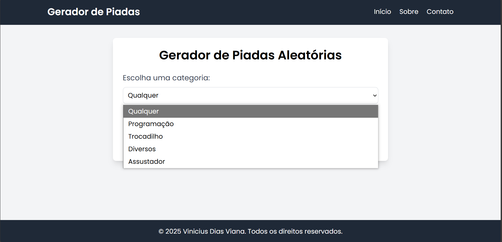
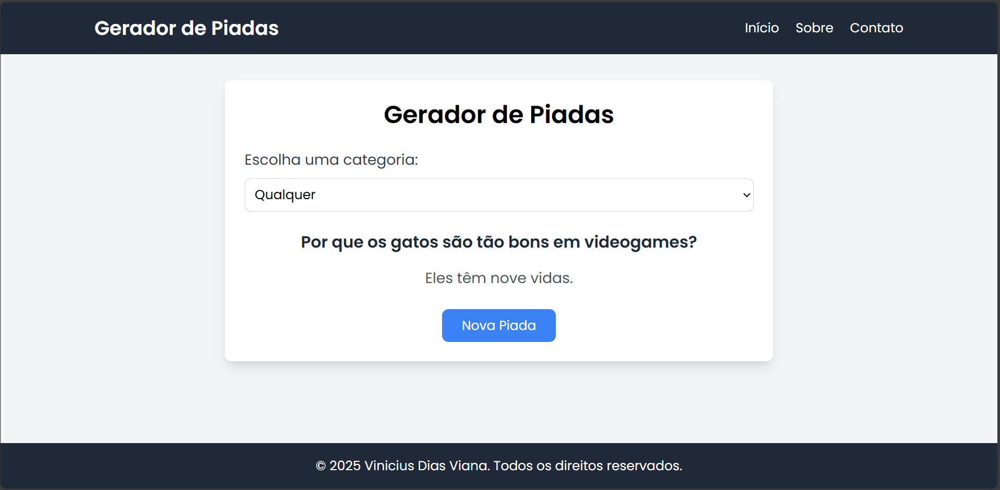

# Gerador de Piadas

Bem-vindo ao **Gerador de Piadas**! Este projeto foi desenvolvido para gerar piadas aleatórias e proporcionar momentos de diversão. Utilizamos a JokeAPI para obter piadas e a Google Translate API para traduzir as piadas para o português.

## Índice

- [Descrição](#descrição)
- [Funcionalidades](#funcionalidades)
- [Instalação](#instalação)
- [Como Usar](#como-usar)
- [Estrutura do Projeto](#estrutura-do-projeto)
- [Tecnologias Utilizadas](#tecnologias-utilizadas)
- [Contribuição](#contribuição)
- [Licença](#licença)
- [Capturas de Tela](#capturas-de-tela)

## Descrição

O **Gerador de Piadas** é uma aplicação web que permite ao usuário gerar piadas aleatórias com base em diferentes categorias. As piadas são obtidas de uma API pública e traduzidas para o português, garantindo que sejam adequadas para todos os públicos.

## Funcionalidades

- Gerar piadas aleatórias
- Seleção de categorias de piadas
- Tradução automática das piadas para o português
- Interface amigável e responsiva

## Instalação

Para instalar e executar o projeto localmente, siga os passos abaixo:

1. Clone o repositório:
    ```bash
    git clone https://github.com/viniciusviana08/gerador-de-piadas.git
    ```
2. Navegue até o diretório do projeto:
    ```bash
    cd gerador-de-piadas
    ```
3. Crie um ambiente virtual:
    ```bash
    python -m venv venv
    ```
4. Ative o ambiente virtual:
    - No Windows:
        ```bash
        venv\Scripts\activate
        ```
    - No macOS/Linux:
        ```bash
        source venv/bin/activate
        ```
5. Instale as dependências:
    ```bash
    pip install -r requirements.txt
    ```
6. Inicie a aplicação:
    ```bash
    flask run
    ```

## Como Usar

1. Abra a aplicação em seu navegador acessando `http://127.0.0.1:5000`.
2. Na página inicial, selecione uma categoria de piada no menu suspenso.
3. Clique no botão "Nova Piada" para gerar uma nova piada aleatória.
4. A piada será exibida na tela, juntamente com a tradução, se aplicável.

## Estrutura do Projeto

A estrutura do projeto é organizada da seguinte forma:

```
gerador-de-piadas/
│
├── templates/
│   ├── contato.html
│   ├── index.html
│   ├── sobre.html
│
├── app.py
├── requirements.txt
├── readme.md
```

- `templates/`: Contém os arquivos HTML para as diferentes páginas do site.
- `app.py`: Arquivo principal da aplicação Flask.
- `requirements.txt`: Lista de dependências do projeto.
- `readme.md`: Arquivo de documentação do projeto.

## Tecnologias Utilizadas

- Flask (Backend)
- Tailwind CSS (Design)
- JokeAPI (Integração de Piadas)
- Google Translate API (Tradução)
- HTML
- CSS
- JavaScript

## Contribuição

Contribuições são bem-vindas! Se você deseja contribuir com o projeto, siga os passos abaixo:

1. Faça um fork do repositório.
2. Crie uma branch para sua feature:
    ```bash
    git checkout -b minha-feature
    ```
3. Commit suas mudanças:
    ```bash
    git commit -m 'Adiciona minha feature'
    ```
4. Faça push para a branch:
    ```bash
    git push origin minha-feature
    ```
5. Abra um Pull Request.

## Licença

Este projeto está licenciado sob a Licença MIT. Veja o arquivo [LICENSE](LICENSE) para mais detalhes.

## Capturas de Tela

Adicione aqui algumas capturas de tela do projeto em funcionamento:




